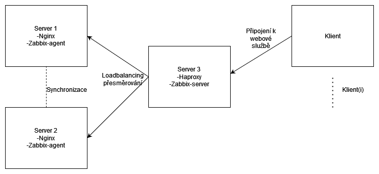

= Nginx, proxy, loadbalancing dokumentace

== Cíl projektu

V tomto projektu se zaměřím na problematiku nginx, proxy a loadbalancingu, spustím webový dva webové servery, které budou zprovoněny pomocí nginx, tyto servery budou identické, mezi servery a hosty bude připojen další server fungující jako prostředník s aplikacemi Haproxy a zároveň bude monitorovat server 1 a 2 pomocí aplikace zabbix.

== Nainstalované aplikace:
* Nginx
* Zabbix
* Haproxy
* Mariadb

== Konfigurace vagrant:
Vagrant file je nakonfigurován, aby byli tři servery a jeden host.

[source, ruby]
----
include::Vagrantfile[]
----

== Startup soubor
Zajišťuje, aby všechny yml soubory byly použity při spuštění.
[source, yml]
----
include::startup.yml[]
----
    
== Copy config
Kopíruje základní konfiguraci stanic.
[source, yml]
----
include::copy-config.yml[]
----
    
== Instalace nginx,maria db na s1, 2 pomocí Ansible playbook

[source, yml]
----
include::nginx-server.yml[]
----
    
== Instalace zabbix, haproxy na s3 pomocí Ansible playbook
[source, yml]
----
include::zabbix-server.yml[]
----

== Možnosti loadbalancing algoritmů

K výběru, který algoritmus bylo monoho možností, já jsem použil round robin, protože na internetu byl nejvíce používán a ověřený z různých zdrojů a tím pádem si myslím, že je i nejspolehlivější.

* Round Robin: Dynamický algoritmus, dovede zátěž balancovat za běhu. Přesměrování jsou dělaná na základě vytížení jednotlivých serverů. Zajistí, že procesní čas je také vyvážen. Nejvíce používaný algoritmus.

* Static Round Robin: Každý server je použit podle jeho vytížení, ale oproti klasickému Round Robin balancování nelze změnit zatížení serveru za běhu. Na druhou stranu nemá omezení na počet balancovaných serverů a v případě, že se objeví nový server, tak je okamžitě použit pro novou skupinu požadavků. 

* Least Connections: Také dynamický algoritmus, jako Round Robin, server, který má nejméně připojení je preferován. Tento algoritmus je vhodný pro delší požadavky, jako například práce s databázemi a podobně. Není tak vhodný pro kratší požadavky jako http.

* Source: Zahaskuje zdrojovou IP adresua vydělí hodnotu zatížením všech serverů. Stejné klientské IP se vždy připojí na stejné servery. Pokud se změní počet serverů a tím pádem i hodnota hashe, tak se klienti budou připojovat na server jiný. Většinou používán v TCP, kde nemohou být použity cookies. 

* URI: Algoritmus zahashuje buď levou část URI nebo celé a vydělí hodnotu hashe celkovým počtem běžících serverů. Stejná URI budou vždy přesměrována na stejný server, pokud servery nejsou ve  stavu down.

* URL Parameter: Statický algoritmus, lze použít pouze pro http backend. URL parametr, který je v hledaném dotazuse vyhledá v každém http GET requestu. Pokud se parametr shoduje, tak se hodnota zahashuje a vydělí počtem běžících serverů.

== Logy
Další důležitou kapitolou projektu jsou logy. Já osobně jsem nastavil rsyslog, aby přesměrovával veškeré logy pomocí templatu, do složky /vagrant/hostname/appname, jelikož v praxi si myslím, že by složka vagrant by představovala vzdálené uložiště nesouvisející se servery. Tím pádem v případě, že by například zhavarovaly všechny servery najednou, tak nemusíme metodou pokus omyl nějaký zprovozňovat, aby jsme se dostali k logům, ale jednoduše si logy přečteme ze zmíněného uložiště. V praxi by to mohl být NAS server, externí uložiště připojené přímo k nějakému ze serverů, ... , ale pro demonstrační účely projektu si myslím, že toto řešení je postačující.

==== Konfigurace rsyslog:

    $template RemoteLogs,"/vagrant/logy/%HOSTNAME%/%PROGRAMNAME%.log"
    *.* ?RemoteLogs

== Zálohování
Pro zálohování dat jsem použil crontab.

	0 0 * * *  root mysqldump -u root -p[password] -x -A > /vagrant/zalohy/dbs.sql
	
V současnosti zálohuji pouze databázi na serveru 3, kde se nachází Zabbix, zálohování je nastaveno na jednou za 24 hodin. Na serverech 1 a 2 se databáze prozatím nenachází, v budoucnu bych mohl zálohovat i stav aplikace běžící na nginx, prozatím jsem se aplikační stránku nerozhodl dělat, jelikož byla označená jako nepovinná, takže na těchto serverech není prozatím co zálohovat. Zálohy opět dávám do sdílené složky vagrant a pak /zalohy. V současnosti je myšlenka podobná jako u logů, myslím si, že zálohovat na jiné servery je nesmyslné a zbytečně riskatní.

== Zdroje
* https://www.zabbix.com/forum/zabbix-troubleshooting-and-problems/7805-looping-during-setup
* https://stackoverflow.com/questions/43721426/zcat-failing-in-ansible-playbook
* https://www.server-world.info/en/note?os=CentOS_Stream_9&p=zabbix60&f=1
* https://www.stackpath.com/blog/load-balancing-haproxy
* http://woshub.com/haproxy-load-balancer-nginx/
* https://www.shellhacks.com/ansible-run-shell-command-on-remote-host/
* https://linuxhint.com/setup_haproxy_load_balancer_centos8/
* http://www.yamllint.com/
* https://docs.ansible.com/ansible/latest/collections/azure/azcollection/azure_rm_mariadbserver_module.html3
* https://mariadb.com/kb/en/making-backups-with-mysqldump/
* https://www.ibm.com/docs/en/aix/7.2?topic=c-crontab-command
* https://asciidoclive.com/edit/scratch/1
